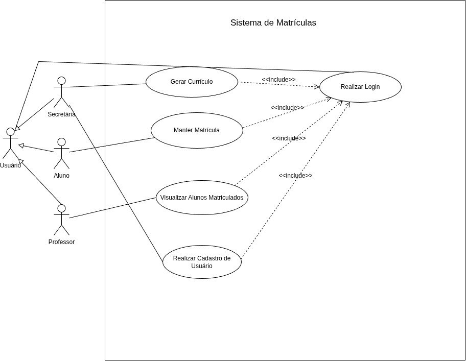

# Sistema de Matrículas
## Requisitos
RF01 - A secretaria gera currículos para cada semestre 
RF02 - A secretaria gerencia as disciplinas
RF03 - A secretaria gerencia os professores
RF04 - A secretaria gerencia os alunos
RF05 - A secretaria define o período de matrículas 
RF06 - O aluno gerencia suas matriculas
FR07 - O professor visualiza os alunos matriculados
RF08 - O aluno é cobrado pelas suas disciplinas
RF09 - O sistema deve autenticar todos os usuários

## User Stories
US01: Como um secretário, quero gerar currículos para cada semestre, para que o aluno possa visualizar as disciplinas disponíveis e seus respectivos professores
AC01: O secretário gera apenas 1 currículo por semestre
AC02 - Vínculo de Professores Ativos: O sistema deve validar e permitir apenas a associação de professores que possuam o status "Ativo" no sistema no momento da geração do currículo.

---

US02: Como uma secretária, quero gerenciar as disciplinas da universidade, para que possa disponibilizá-las nos currículos dos semestres.
AC03: A secretária deve conseguir cadastrar, editar, consultar e excluir disciplinas.
AC04: O sistema deve exigir o preenchimento dos dados obrigatórios da disciplina.
AC05: As disciplinas cadastradas devem poder ser associadas aos currículos dos semestres.

---

US03: Como um secretário, quero gerenciar os professores, para que eu possa cadastrar, excluir ou deletar um professor
AC06 - O sistema deve permitir o soft delete de um professor, desde que ele não possua turmas ativas vinculadas no período letivo corrente (caso possua, o sistema deve exibir uma mensagem de erro preventiva).
AC07 - Editar dados de professor: O sistema deve permitir a alteração das informações cadastradas de um professor existente.
AC08 - Cadastrar professor com sucesso: O sistema deve permitir o cadastro de um novo professor informando os dados obrigatórios (Nome, CPF, E-mail e Disciplinas ministradas), validando a unicidade do CPF e do e-mail.

---

US04: Como uma secretária, quero gerenciar os alunos, para que eles possam acessar o sistema e realizar suas matrículas.
CA09: A secretária deve conseguir cadastrar, editar, consultar e excluir alunos.
CA10: O sistema deve exigir os dados obrigatórios do aluno.
CA11: Alunos cadastrados devem conseguir acessar o sistema mediante autenticação.

---

US05: Como um secretário, quero definir o período de matrícula, para que nenhum aluno possa se matricular depois dele 
AC12 - Configuração de datas: O sistema deve permitir ao secretário definir uma data/hora de início e uma data/hora de término para o período de matrícula.
AC13 - Bloqueio automático pós-prazo: O sistema deve proibir automaticamente qualquer tentativa de matrícula realizada antes do início ou após a data/hora de término configurada.

---

US06: Como aluno, quero gerenciar minhas matrículas em disciplinas, para que possa montar minha grade conforme minhas necessidades.
CA14: O aluno deve conseguir se matricular em até 4 disciplinas como 1ª opção.
CA15: O aluno deve conseguir selecionar até 2 disciplinas como alternativas (optativas).
CA16: O aluno deve conseguir cancelar matrículas durante o período de matrículas.
CA17: O sistema não deve permitir matrícula em disciplinas que já atingiram 60 alunos.
CA18: Ao finalizar a matrícula, o sistema deve enviar os dados ao sistema de cobranças.

---

US07: Como um professor, quero visualizar a lista de alunos matriculados nas minhas disciplinas, para que eu possa acompanhar a quantidade de estudantes na turma e emitir a lista de chamada.
AC19 - O professor deve visualizar apenas as disciplinas nas quais está vinculado como docente no período atual.
AC20 - O professor deve ter a opção de exportar ou gerar uma lista de presença formatada com os alunos da turma.

---

US08: Como sistema de cobranças, quero receber as informações das disciplinas em que o aluno está matriculado, para que possa realizar a cobrança correspondente ao semestre.
AC21: O sistema deve enviar ao sistema de cobranças os dados das disciplinas matriculadas pelo aluno.
AC22: A cobrança deve considerar somente as matrículas confirmadas.
AC23: A notificação deve ser enviada ao sistema de cobranças após a conclusão da matrícula.
AC24: O sistema deve informar o aluno e as disciplinas vinculadas à cobrança.

---
US09: Como um usuário do sistema, quero realizar o login informando minhas credenciais, para acessar as funcionalidades exclusivas do meu perfil com segurança.
AC25 - O sistema deve permitir o acesso apenas após a inserção de e-mail/usuário e senha corretos, redirecionando o usuário para o painel correspondente ao seu perfil (Secretário, Professor ou Aluno).
AC26 - O sistema deve bloquear temporariamente a conta após 3 tentativas consecutivas de login com senha incorreta.

## Diagrama de Caso de Uso
